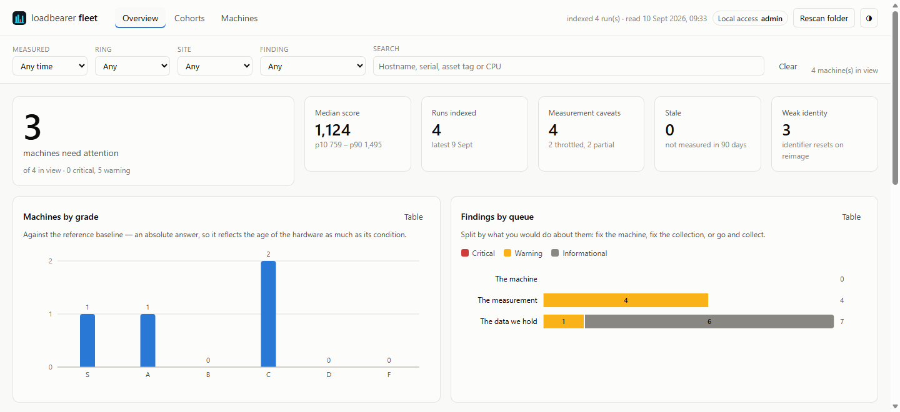

# loadbearer-fleet

A fleet dashboard over collected [loadbearer](https://github.com/issinoho/loadbearer)
results: point it at the folder your deployment tool drops `.json` result files
into, and it indexes them and reports across the estate — executive summary,
grouping, drilldown, and the outliers and red flags worth acting on.

**Status: early but usable.** Ingest, cohort analytics, the red-flag engine, the
web dashboard and single sign-on all work. Out of the box it runs
unauthenticated on loopback; point it at your identity provider and it does OIDC
with roles and per-site scoping. See [Roadmap](#roadmap).

## Getting started

The dashboard reads a folder of result files, so the whole job is: get one
result into one folder, then point this at the folder. No configuration file, no
sign-in, no database to create. Five minutes, and the last step is a browser.

### 1. Collect one result

The results come from [loadbearer](https://github.com/issinoho/loadbearer),
which is a separate tool — install it first.

**Windows** (PowerShell). Its Windows binary *is* Authenticode-signed, so this
part raises none of the warnings [described below](#a-note-on-the-windows-binary):

```powershell
$zip = "loadbearer-1.5.1-x86_64-pc-windows-msvc.zip"
Invoke-WebRequest "https://github.com/issinoho/loadbearer/releases/download/v1.5.1/$zip" -OutFile $zip
Expand-Archive $zip -DestinationPath . -Force
mkdir C:\loadbearer\results
.\loadbearer-1.5.1-x86_64-pc-windows-msvc\loadbearer.exe `
  run --duration short --output C:\loadbearer\results\$env:COMPUTERNAME.json
```

**Linux** (Ubuntu 22.04 / 24.04 / 26.04):

```bash
sudo add-apt-repository ppa:issinoho/loadbearer
sudo apt install loadbearer
mkdir -p ~/loadbearer/results
loadbearer run --duration short --output ~/loadbearer/results/$(hostname).json
```

`--duration short` is about ten seconds per benchmark, which is enough to see
the dashboard work. Two things worth getting right from the start:

- **`--output` takes a file, not a folder.** Name it after the machine, as
  above, so results from different machines land side by side instead of
  overwriting each other. The dashboard doesn't care what they are called — it
  identifies machines from what is *inside* them — but you will.
- **Standardise on one `--duration` across the estate.** Results are only
  comparable within the same one, which is why the cohort analysis treats it as
  part of a machine's peer group. `normal` is the sensible fleet default;
  `short` is for trying things out.

### 2. Get loadbearer-fleet

Download the archive for your platform from the
[latest release](https://github.com/issinoho/loadbearer-fleet/releases/latest)
and unpack it. There is nothing to install: one binary, no runtime, no
dependencies.

**Windows** — take the `-x86_64-pc-windows-msvc.zip`, unzip it anywhere, then:

```powershell
cd loadbearer-fleet-0.1.0-x86_64-pc-windows-msvc
.\loadbearer-fleet.exe serve C:\loadbearer\results
```

**Linux** — take the `-x86_64-unknown-linux-gnu.tar.gz`:

```bash
curl -LO https://github.com/issinoho/loadbearer-fleet/releases/download/v0.1.0/loadbearer-fleet-0.1.0-x86_64-unknown-linux-gnu.tar.gz
tar xzf loadbearer-fleet-0.1.0-x86_64-unknown-linux-gnu.tar.gz
cd loadbearer-fleet-0.1.0-x86_64-unknown-linux-gnu
./loadbearer-fleet serve ~/loadbearer/results
```

Or build it yourself:

```
cargo install --git https://github.com/issinoho/loadbearer-fleet --locked
```

That needs Rust 1.88 or newer **and a C compiler** — SQLite is compiled from
source and bundled in, which is why there's no database to install. On
Debian/Ubuntu that's `build-essential`; on Windows, the Visual Studio C++ build
tools. Nothing else: TLS is rustls, so there is no OpenSSL to find.

### 3. Open it

```
http://127.0.0.1:8787
```



*The overview, rendered from the four anonymised result files in
`tests/fixtures` — real measurements, identifiers replaced.*

That's it. The overview shows your one machine and its grade against the
reference baseline, and **0 machines need attention** — with nothing to compare
it against, there is nothing yet to say. The reason is filed as an
informational note, under *Show 1 informational* on the overview and on the
**Cohorts** tab: a peer group needs four machines running the same hardware and
the same configuration before its median means anything. Collect a few more and
the comparison that actually matters switches itself on.

### What you get without configuring anything

| | |
| --- | --- |
| Listening on | `127.0.0.1:8787` — loopback only, and it [refuses](#it-will-not-put-the-estate-on-the-wire-in-the-clear) to listen wider without sign-in and TLS |
| Sign-in | None. Everyone who can reach the port is an administrator, and the header says so |
| The index | `fleet-index.db`, in whatever directory you started it from. Derived data — delete it and it rebuilds from the folder ([one caveat](#what-an-index-format-change-does-to-your-history)) |
| Refresh | Rescans the folder every 15 minutes, or when you press **Rescan folder** |

Starting it before you have any results is fine — an empty folder serves an
empty dashboard, and results appear as they land.

### Then, in whatever order suits

- **Point it at the real collection folder** instead of a local one. Anything
  the process can read works, including a UNC path:
  `loadbearer-fleet serve \\fileserver\loadbearer`. Have your deployment tool
  write each machine's `--output` there — see loadbearer's
  [Fleet Deployment](https://github.com/issinoho/loadbearer/wiki/Fleet-Deployment)
  wiki page for the unattended side, including the `--tag` labels this groups by.
- **Run it as a service** so it survives a reboot and rescans on its own —
  see [Running it as a service](#running-it-as-a-service).
- **Turn on single sign-on** before anyone but you can reach it — see
  [Sign-in](#sign-in).

### A note on the Windows binary

It is **unsigned**, and unlike loadbearer it never gets signed: CI can't reach
the code-signing certificate, and nothing re-signs it by hand afterwards. So on
a clean Windows install expect one of these:

- **SmartScreen** — "Windows protected your PC". *More info → Run anyway*, or
  `Unblock-File .\loadbearer-fleet.exe` before running it.
- **Smart App Control**, on by default on clean Windows 11 installs — blocks
  unsigned binaries outright, with no allow-list or file-hash exception. Build
  from source with the `cargo install` line above, or run it on a machine
  without SAC.
- **WDAC / AppLocker** — add a **file-hash** rule; hash rules permit an
  unsigned binary where publisher rules don't. The exact SHA-256 of the
  executable inside the archive is listed in the release's `SHA256SUMS`, which
  is why it's there.

## How it fits together

```
  PDQ / Intune / Ansible          this
  runs loadbearer on each   ->   \\share\loadbearer\*.json   ->   index   ->   dashboard
  machine, writes --output          (source of truth)          (derived)
```

Three decisions shape everything else:

**The folder is the source of truth.** The index is a derived read model, so
deleting it costs a rescan and nothing else — which is why its shape can change
freely and why there is nothing to migrate. With one caveat that depends on
your collector: the index keeps a row per *run*, so if each machine overwrites a
single file, the index ends up holding history the folder no longer has — which
is why a format change renames it rather than dropping it, and why
[`archive_dir`](#backup-restore-and-moving-to-another-server) exists to put
that history back into files.

**It reads the schema, not loadbearer's code.** loadbearer's `VERSIONING.md`
makes the `schema`-tagged JSON a stability contract and says in the same breath
that its internal Rust API is not one. So this parses the document. The two
projects release independently and the contract between them is the thing
that's actually promised.

**Data quality is a first-class input, not an afterthought.** loadbearer records
when a run shouldn't be taken at face value — a thermally limited machine, a
measurement taken on battery, a `--target-dir` that turned out to be a RAM disk,
a component a security policy blocked. Ranking an estate while ignoring those
would produce confident nonsense, so they're indexed alongside the numbers and
surfaced.

## Usage

```
loadbearer-fleet scan \\fileserver\loadbearer      # index a folder (or re-index it)
loadbearer-fleet status                            # what's in the index
loadbearer-fleet report                            # summary, cohorts and red flags
loadbearer-fleet report --all                      # include informational flags
loadbearer-fleet report --json                     # the whole snapshot, as the UI sees it
loadbearer-fleet serve \\fileserver\loadbearer     # the dashboard, on http://127.0.0.1:8787
loadbearer-fleet init-config > fleet.toml          # a starter config, placeholders included
loadbearer-fleet serve --config fleet.toml         # with single sign-on
loadbearer-fleet check-auth --config fleet.toml    # check the identity provider settings
loadbearer-fleet backup fleet-2026-09-10.db        # consistent snapshot, safe while serving
loadbearer-fleet forget PC-01                      # remove a decommissioned machine
```

Rescanning is cheap and idempotent: every run is keyed by the SHA-256 of the
document it came from, so an unchanged file is a no-op and a file the collector
renamed on copy doesn't become a second run.

## Identity, and why grouping is trustworthy

Runs are attributed to a machine by the best identifier the result carries:

| | survives a reimage | notes |
| --- | --- | --- |
| `serial` | yes | what asset, warranty and lease records key on |
| `smbios_uuid` | yes | absent on some VMs |
| `machine_id` | **no** | always readable; resets on reimage |
| `hostname` | no | renameable and reissued — a last resort |

This matters in practice and not just in theory: on Windows all four are
readable by any user, but on Linux the DMI serial and UUID are root-only, so an
unprivileged sweep there keys on `machine_id`. In testing against seven real
machines, three keyed on `serial` and four on `machine_id`. The dashboard
reports which, because "four of your machines are keyed on an identifier that
resets when they're reimaged" is something an estate owner should know.

## Roadmap

- [x] Schema reader, tolerant of older files and forward-compatible with new fields
- [x] Folder scan into a SQLite index, idempotent by content, full history retained
- [x] Cohort analytics — compare a machine against its own peer group, and against
      its own history, rather than against the reference baseline
- [x] Red flags: low grades, cohort outliers, regressions, weak components, thermal
      limits, forced runs, partial runs, RAM-backed disk targets, battery wear,
      stale results, weak identity
- [x] Web UI: executive summary, cohort explorer, machine table, machine drilldown
      with history — see [The dashboard](#the-dashboard)
- [x] Entra ID / OIDC SSO with PKCE, roles from group claims, tag-scoped
      authorization — see [Sign-in](#sign-in)
- [x] Service packaging, config file, metrics — see [Running it as a service](#running-it-as-a-service)
- [x] Backup, restore and moving between instances — see [Backup, restore, and
      moving to another server](#backup-restore-and-moving-to-another-server)

## Analysis

### Peers first, then history, then the baseline

The reference baseline answers "is this machine any good". It is the wrong tool
for "is this machine broken": loadbearer's own baseline header puts ±10–20%
uncertainty on the anchors, and some of them rest on three machines. A 15%
shortfall against the baseline could be the baseline.

So the primary comparison is **a machine against its peers**, and the secondary
one is **a machine against its own history** — which is stronger still, because
the hardware is held constant. A machine 15% down on forty identical machines in
the same estate, or 15% down on its own last four runs, is the machine.

A cohort is not "machines with the same CPU" but machines with the same CPU
*measured the same way*: `build_isa`, `duration_preset`, `profile` and `baseline`
each change the number without anything changing about the machine, so each is
part of the cohort key. Installed RAM deliberately is not — two machines with the
same CPU and different DIMM configurations really do differ, and surfacing the
single-channel one is the point rather than something to excuse.

Cohorts use **median and median absolute deviation**, not mean and standard
deviation, because the statistic has to survive the thing it is looking for. Six
machines at 1000 and two at 720 have a mean of 930 and a standard deviation of
118, which puts the two bad ones 1.8 sigma out — invisible to a 3.5-sigma rule,
because each one's damage is partly absorbed into the spread the other is
measured against. The median stays at 1000 and names both. On a fleet of clones
MAD collapses towards zero, so the dispersion is floored at a fraction of the
median; that floor is usually what binds, and it puts the effective trigger at
around a 15% shortfall.

### Three queues, not one wall of red

Findings are separated by what you would do about them, because mixing them
means an estate owner reads a thermal caveat as a failing asset:

| Queue | Means | Examples |
| --- | --- | --- |
| **machine** | a hardware decision — repair, replace, reassign | low grade, cohort outlier, regression, one weak component, worn battery |
| **measurement** | the number can't be trusted until collection is fixed | thermally limited, run on battery, partial run, RAM-backed disk target, unstable CPU timings |
| **coverage** | about the data we hold, not about the machine | stale result, attributed by hostname only, no peer group |

Every threshold lives in one struct with its reasoning attached, so tuning the
engine is a config change rather than a code read.

## The dashboard

```
loadbearer-fleet serve \\fileserver\loadbearer
```

Scans the folder, then serves four views on `127.0.0.1:8787`: an executive
**overview** (how many machines need attention, grade distribution, findings by
queue, score spread, and the ranked list of what to look at), a **cohort
explorer** (each machine against the median of the machines like it), a sortable
**machine table**, and a **drilldown** per machine with its score history, its
components, its findings in full, and every subtest of its latest run.

`POST /api/rescan` — the Rescan button — re-reads the folder. `GET /api/snapshot`
returns exactly what the dashboard draws, so any view can be scripted or
diffed; `GET /api/machine/{key}` is the drilldown payload.

### No build step, no CDN, one binary

The HTML, CSS and JavaScript are compiled into the executable, and the charts
are hand-rolled SVG. There is no npm, no bundler, and nothing is fetched from
the internet at runtime — which is what makes it work on an air-gapped
management network, and what lets the server send `default-src 'self'` and mean
it.

### The charts

Built to the Claude Code `dataviz` skill's specs, and the colour work was
computed rather than eyeballed: the diverging blue/red pair passes all six
checks in both light and dark mode. Grades get a single hue rather than an
ordinal ramp, because six steps cannot clear the ramp's adjacent-lightness gate
inside the range the surface allows — and the axis already carries the order.
Every chart has a table view, so no value is ever reachable only by hovering,
and hover and keyboard focus show the same thing.

`node scripts/check-ui.mjs` renders every chart and every view against a
minimal DOM and asserts the geometry: no NaN reaching an SVG attribute, nothing
painted outside its own box, bars capped at 24px, markers carrying their surface
ring, hit targets big enough to hit, and axis labels that fit their band. It
needs Node; the server does not, so it is deliberately outside `cargo test`.

## Checks

What CI runs, and what to run before pushing:

```
cargo fmt --all --check
cargo clippy --all-targets --locked -- -D warnings
cargo test --locked
cargo build --locked && node scripts/check-ui.mjs
```

Clippy and the tests run on both ubuntu-latest and windows-latest, and both
matter for more than the tests: the Windows service integration is behind
`cfg(windows)` and the fallbacks that replace it are behind
`cfg(not(windows))`, so either build only ever compiles one of the two.

CI also checks the declared MSRV (`rust-version = "1.88"`) on both platforms
with `cargo check --all-targets --locked`. That promise is one nothing else
would notice breaking, and it usually breaks because a dependency raised its
own floor during a routine `cargo update` rather than because of anything in
this crate. Dependabot groups its weekly bumps into one PR, so when one goes
red, read which matrix leg failed before assuming the whole group is bad.

## Sign-in

```
loadbearer-fleet init-config > fleet.toml     # then fill in the placeholders
loadbearer-fleet check-auth --config fleet.toml
loadbearer-fleet serve --config fleet.toml
```

OpenID Connect authorization code flow with PKCE. Register the app as a public
client — the flow needs no client secret, and a secret in a config file on a
management server is a secret in every backup of that server — with the redirect
URI `<public_url>/auth/callback`.

Roles come from group claims. On Entra, emit the `groups` claim from the app
registration's **Token configuration** (it is a token setting, not a scope), and
map group **object IDs** to roles:

```toml
[[auth.grants]]
group = "<object-id-of-your-fleet-admins-group>"
role = "admin"     # read the dashboard, and trigger a rescan

[[auth.grants]]
group = "<object-id-of-the-glasgow-desktop-team>"
role = "viewer"    # read only
tags = { site = "glasgow" }   # and only the machines tagged this way
```

The most privileged matching grant wins; scopes are the union of the matching
grants at that role, so somebody in two site groups sees both sites. Someone who
authenticates but matches no grant is refused rather than shown an empty
dashboard — authenticating is not the same as being authorized.

**Tag scoping is enforced in the data layer.** A viewer's scope is pushed into
the same filter every request is projected through, and it is read from the
session, never from the query string — so a scoped viewer who edits the URL to
another site gets an empty result, never that site. A machine outside your scope
returns 404 rather than 403: whether it exists isn't something you're entitled to
learn. The Rescan button is hidden from viewers as a courtesy; the server refuses
the request whether it was hidden or not.

Two things the config refuses at load time rather than at first sign-in: any
value still holding a starter placeholder, named individually; and a multi-tenant
issuer (`/common/`, `/organizations/`, `/consumers/`), which cannot work because
those endpoints advertise a templated `{tenantid}` issuer that never matches the
URL it was fetched from. Use your own tenant's issuer.

Sessions are opaque random tokens in an `HttpOnly`, `SameSite=Lax` cookie, held
server-side and keyed by the token's SHA-256 so a memory dump doesn't hand
anyone a live session. They live in memory, so a restart signs everyone out;
there are no refresh tokens stored anywhere.

### It will not put the estate on the wire in the clear

The index holds the hostname and firmware serial of every machine you own, so a
non-loopback bind is refused unless **both** sign-in is configured and
`public_url` is https. `--allow-remote` overrides it and logs a warning. The two
refusals say different things because they are different mistakes: without
sign-in, anyone who can reach the port gets the whole estate; without TLS, the
session cookie crosses the network in the clear and whoever copies it is signed
in as that user.

The dashboard does not terminate TLS. Put a reverse proxy in front of it and set
`public_url` to the proxy's address.

## Running it as a service

```
loadbearer-fleet init-config > C:\ProgramData\loadbearer-fleet\fleet.toml
# fill it in, then:
loadbearer-fleet --config C:\ProgramData\loadbearer-fleet\fleet.toml service install
sc start loadbearer-fleet
```

On Linux, `service unit --config /etc/loadbearer-fleet/fleet.toml` prints a
systemd unit — hardened, because this process reads a share and writes one
database and never needs a new privilege, an executable mapping or a raw socket.
Review it, drop it in `/etc/systemd/system`, `systemctl enable --now`.

It stops when it is told to. systemd's SIGTERM, Ctrl+C and the Windows service
controller's stop request all land in the same shutdown path, so a restart is
never a kill after a timeout with the index half-written. On Windows it reports
`StartPending` while the first scan runs, so scanning a large share isn't
mistaken for a hung service, and it reinstates itself after a crash (5s, 30s,
5min).

**It rescans on a timer** — `scan_interval_minutes`, 15 by default. This is what
makes it a service rather than a command: a dashboard that only refreshes when
somebody clicks is out of date exactly when nobody is looking at it. A scan that
fails logs and carries on; one network blip shouldn't stop a dashboard
refreshing for good.

Two traps the installer refuses to walk into. **Relative paths**: Windows starts
a service in `System32` and systemd in `/`, so paths in the config are resolved
against the config file, and installing without an absolute `--config` is
refused. **Nowhere to log**: a service has no console, so without `[log] file`
there is no way to find out why it didn't start, and the installer says so
rather than letting you find out later. Logs rotate daily and can be `json` for
a collector.

## Upgrading

Stop it, replace the binary, start it. There is no migration step and nothing
to back up: if a release ever changes the index's internal shape it keeps the
old one for you rather than dropping it, which is [worth understanding
once](#what-an-index-format-change-does-to-your-history) but needs nothing from
you at the time.

**Windows service:**

```powershell
sc stop loadbearer-fleet
# replace loadbearer-fleet.exe with the new one, in the same place
sc start loadbearer-fleet
```

Stopping it first is not optional: Windows locks a running executable, and the
copy will fail with "access is denied" rather than doing anything clever.

**Linux (systemd):**

```bash
sudo systemctl stop loadbearer-fleet
sudo install -m755 loadbearer-fleet /usr/local/bin/loadbearer-fleet
sudo systemctl start loadbearer-fleet
```

**Run by hand:** stop it, unpack the new archive over the old one, start it.
The service registration and the unit file both point at a path, so replacing
the file at that path is the whole job — there is nothing to re-install unless
you move it.

### What holds state, and what happens to it

| | Survives an upgrade | |
| --- | --- | --- |
| The collection folder | **Yes** | The results themselves, and the source of truth. This tool only ever reads it — it has no code that writes there. |
| The index | Rebuilt if it has to be, and the old one kept | Derived data. If a release changes its internal shape, the existing file is renamed to `…superseded-v1-<when>.db` and a fresh one is rebuilt from the folder — `serve` does that in its startup scan, so it is invisible, though a bare `report` straight afterwards would show an empty fleet until you `scan`. [What that means for history](#what-an-index-format-change-does-to-your-history). |
| Your config file | **Yes** | New options arrive with defaults, so a file written for an older version keeps working untouched. |
| Sessions | No | Held in memory, so everyone signs in again. Against an identity provider they are already signed in to, that is one redirect they will barely notice. |

Downgrading is the direction that bites, and it fails loudly rather than
quietly: the config rejects keys it doesn't know, so a file that has picked up
a newer release's options will stop an older binary with
``unknown field `x`, expected one of ...``. Delete the newer keys, or keep the
old config alongside.

### What an index-format change does to your history

Rarely, a release changes the index's internal shape. [CHANGELOG.md](CHANGELOG.md)
will say so when it happens, and there is nothing for you to do — but it is
worth knowing what it does, because it depends on how your collector names its
files.

The old index is **renamed, not deleted**:

```
fleet-index.db                                  <- fresh, rebuilt from the folder
fleet-index.superseded-v1-20260910T090735Z.db   <- everything it held before
```

Then the folder is rescanned into a clean index. If your collector writes **one
file per run**, that rebuild is complete and the preserved file is just
belt-and-braces.

If it writes **one file per machine and overwrites it** — the
`--output …\%COMPUTERNAME%.json` pattern in [Getting
started](#1-collect-one-result) — the folder only ever holds each machine's
*latest* result, so the index was the only record of the runs before it. The
rebuild brings the current state back intact, and the dashboard's trend history
restarts from there. Nothing is destroyed: the earlier runs are in the
preserved file, which is an ordinary SQLite database that any tool can open.
But the live "compare a machine with its own past" comparison will have less to
work with until new runs accumulate.

Two ways to avoid the reset altogether. **Set `archive_dir`**, which keeps
every document indexed so the rebuild is complete whatever your collector does
— see [Backup, restore, and moving to another
server](#backup-restore-and-moving-to-another-server). Or **collect one file
per run**, `--output …\%COMPUTERNAME%-2026-09-10.json` or dated folders, since
`scan` walks subdirectories; the trade-off there is that loadbearer's
`--skip-if-newer-than` guard works off the mtime of a stable `--output` path,
so it pairs with overwriting and not with this.

Delete the preserved files whenever you have decided you don't want them. They
are never read again.

## Backup, restore, and moving to another server

The short version: **the collection folder is the thing worth backing up, and
it is almost certainly already on a share your backup system covers.** This
tool only reads it. Everything else is either rebuildable or a config file
that belongs in source control.

| | Back it up? | Why |
| --- | --- | --- |
| The collection folder | **Yes** — you probably already do | The results themselves. Nothing here writes to it. |
| `archive_dir`, if set | **Yes** | Immutable, content-addressed copies of every result indexed. Small files that never change, so incremental backups copy each one once. |
| The index | Optional | Rebuildable at ~340 runs/second — 60,000 runs in about three minutes. Worth a snapshot only in the case below. |
| The config file | Yes, in source control | Forty lines of TOML. |
| Sessions | No | In memory. A restart signs people out regardless. |

### If your collector overwrites one file per machine

Then the folder holds only each machine's latest result, and the index is the
only record of the runs before it — so *something* has to be kept. Two ways,
and the first is better:

**Set `archive_dir`.** Every document indexed is kept, gzipped and named by its
SHA-256, at about **8 KB per run** — 60,000 runs is half a gigabyte. That puts
the history back into files, which means the index goes back to being
disposable, and moving servers becomes a copy. A run is archived *before* it is
indexed, so "in the index" always implies "kept"; if the archive can't be
written the file is reported and retried rather than indexed anyway.

**Or snapshot the index.** `loadbearer-fleet backup <file>` writes a consistent
copy **while the dashboard is running** — it uses SQLite's `VACUUM INTO`, because
copying a live database with `cp` gives you a torn read and nobody stops a
dashboard nightly for a backup agent. Point your agent at it:

```
loadbearer-fleet --config fleet.toml backup D:\backups\fleet-2026-09-10.db
```

It refuses to overwrite an existing file. Restore is: stop the service, put the
snapshot where `index` points, delete any `-wal`/`-shm` beside it, start.

### Removing a machine — deleting its file is not enough

A scan only ever **adds**. Delete a machine's result file from the collection
folder and nothing changes: the run stays indexed, the machine stays on the
dashboard, and it keeps counting towards the fleet total and its cohort's
median. That is the same property that lets the index hold history an
overwriting collector has discarded, and it surprises people in the other
direction.

```
loadbearer-fleet forget PC-01 --dry-run   # say what would go
loadbearer-fleet forget PC-01             # runs, and archived documents
```

It takes a hostname or the machine key the drilldown shows, removes that
machine's runs and everything hanging off them, and deletes the documents it
archived for them. If a hostname matches two machines — they get reissued — it
lists both and asks you to pick by key rather than guessing.

**It does not touch the collection folder.** Nothing in this tool writes there,
and deleting an estate's authoritative results on the strength of a hostname
typed at a prompt is not a habit worth starting. So `forget` tells you which
files are still present, because while they are, the next scan indexes the
machine straight back:

```
removed 1 run(s) for PC-01 (SN-0012345)
removed 1 archived document(s)

Still in the collection folder — the next scan will index this machine again
unless these go:
  \\fileserver\loadbearer\PC-01.json
```

So a decommissioned machine, or a removal request, is three rungs:

1. Delete its result files from the collection folder.
2. `loadbearer-fleet forget <machine>` — index rows and archived copies.
3. Nothing else. Sessions hold no fleet data and metrics carry no machine
   labels.

Do them in that order and it stays gone; do only (2) and it returns within
`scan_interval_minutes`.

### Moving to another server

```
# on the new server: same config, then either
loadbearer-fleet scan \\fileserver\loadbearer      # if the folder has a file per run
loadbearer-fleet scan D:\archive                   # or import the archive you copied over
```

There is no export format and no import command, deliberately. The interchange
format is `loadbearer.result/1` — the contract loadbearer already promises —
so moving data is moving files, and `scan` reads `.json` and `.json.gz` alike.
Nothing new to version, nothing that can drift.

**Consolidating two servers** is the same operation: copy both archives into
one place and scan it. Runs are keyed by the SHA-256 of their document, so
anything the two instances both saw is stored and counted once.

An index copied from another server is fine too, as long as both are the same
release — it is a database of a particular internal format, not an interchange
file, which is why the archive is the better answer for anything long-lived.

## Metrics

`[metrics] enabled = true` serves Prometheus on `/metrics`, behind a bearer
token when one is configured — a scrape has no session and cannot get one, so
the token is the whole control, and enabling metrics without one on a
non-loopback bind is refused.

Nothing per-machine is ever exported: no hostname, serial or cohort appears in a
label. Per-machine series would put the estate's inventory into a metrics store
that is usually less protected than this service is, and would multiply the
fleet's size by every label.

Three of them are worth alerting on:

| Metric | Means |
| --- | --- |
| `scan_last_success_timestamp_seconds` | **Collection has stopped.** The failure that hides every other one, because a dashboard full of yesterday's green looks exactly like a healthy estate. |
| `newest_run_age_seconds` | The *machines* have stopped reporting — a different fault from this service having stopped reading. |
| `scan_files_rejected` | Something is writing files this can't parse. One is a truncated upload; a hundred is a broken collector. |

A scan of a folder that can't be read fails loudly and increments
`scan_failures_total` rather than reporting an empty folder, because "no
machines need attention" is how an unreachable share would otherwise look.

## Releases

Tagging is the whole trigger:

```
# 1. bump `version` in Cargo.toml, then `cargo build` so Cargo.lock follows
#    (the release build uses --locked and will refuse otherwise)
# 2. date the CHANGELOG section — the tag's notes are that section, verbatim
# 3. commit, then:
git tag -a v0.1.0 -m "loadbearer-fleet 0.1.0"
git push origin main --follow-tags
```

`release.yml` then builds a self-contained binary for Windows and Linux,
archives each with the README, licence, changelog and a starter config
(generated by the binary itself, so it cannot drift from what the loader
accepts), attaches a **build-provenance attestation** to each, writes
`SHA256SUMS`, and creates the Release with those notes.

```
gh attestation verify loadbearer-fleet-0.1.0-x86_64-unknown-linux-gnu.tar.gz \
  --repo issinoho/loadbearer-fleet
```

That needs no certificate — the trust root is GitHub's Sigstore instance — and
ties the archive to the exact workflow run, commit and repository that produced
it.

A `workflow_dispatch` run builds the same artifacts and leaves them on the run
page without publishing a Release or an attestation, so a candidate can be
tried on a real management server first.

Two things to know:

- **The Linux binary is built on ubuntu-22.04, not latest.** A binary linked
  against a newer glibc will not start on an older one, and this is a service
  that lands on whatever the estate already runs. There is no OpenSSL in the
  tree to complicate it — TLS is rustls.
- **The Windows binary ships unsigned.** The Certum cloud certificate only
  unlocks through an interactive SimplySign session, which a fresh hosted
  runner cannot have. `SHA256SUMS` lists the hash of each archive *and* of the
  bare executable inside it, which is what a WDAC or AppLocker file-hash allow
  rule needs — hash rules permit an unsigned binary where publisher rules
  don't.

## Licence

MIT.
